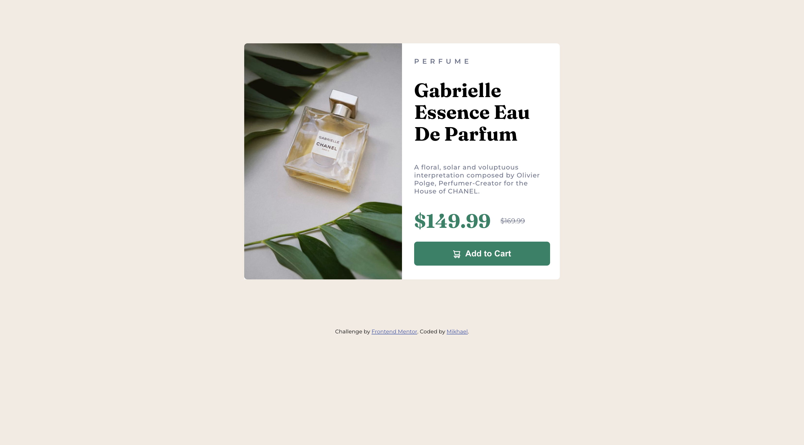

# Frontend Mentor - Product preview card component solution

This is a solution to the [Product preview card component challenge on Frontend Mentor](https://www.frontendmentor.io/challenges/product-preview-card-component-GO7UmttRfa). Frontend Mentor challenges help you improve your coding skills by building realistic projects.

## Table of contents

- [Frontend Mentor - Product preview card component solution](#frontend-mentor---product-preview-card-component-solution)
  - [Table of contents](#table-of-contents)
  - [Overview](#overview)
    - [The challenge](#the-challenge)
    - [Screenshot](#screenshot)
    - [Links](#links)
  - [My process](#my-process)
    - [Built with](#built-with)
    - [What I learned](#what-i-learned)
    - [Continued development](#continued-development)
    - [Useful resources](#useful-resources)
  - [Author](#author)
  - [Acknowledgments](#acknowledgments)

## Overview

### The challenge

Users should be able to:

- View the optimal layout depending on their device's screen size
- See hover and focus states for interactive elements

### Screenshot



Add a screenshot of your solution. The easiest way to do this is to use Firefox to view your project, right-click the page and select "Take a Screenshot". You can choose either a full-height screenshot or a cropped one based on how long the page is. If it's very long, it might be best to crop it.

Alternatively, you can use a tool like [FireShot](https://getfireshot.com/) to take the screenshot. FireShot has a free option, so you don't need to purchase it.

Then crop/optimize/edit your image however you like, add it to your project, and update the file path in the image above.

### Links

- Solution URL: [frontendmentor](https://www.frontendmentor.io/solutions/productpreviewcardcomponentmain-E520fOdzqH)
- Live Site URL: [Vercel](https://product-preview-card-component-main-black.vercel.app)

## My process

### Built with

- Semantic HTML5 markup
- CSS custom properties
- Flexbox
- CSS Grid
- Mobile-first workflow

### What I learned

Use this section to recap over some of your major learnings while working through this project. Writing these out and providing code samples of areas you want to highlight is a great way to reinforce your own knowledge.

To see how you can add code snippets, see below:

Image srcset and aria-label

```html

```

Importing font variation

```css
@font-face {
  font-family: "Montserrat";
  src: url("./fonts/Montserrat/Montserrat-VariableFont_wght.ttf")
    format("truetype-variations");
  font-weight: 125 950;
  font-style: normal;
}
```

Font smoothing

```css
  -webkit-font-smoothing: antialiased;
  -moz-osx-font-smoothing: grayscale;
```

Changing font variations ( **each font variation can have different settings** )

```css
font-variation-settings: "wght" 600;
```

**Example: font Fraunces have SOFT, WONK, opsz, and wght**

```css
@font-face {
  font-family: "Fraunces";
  src: url("./fonts/Fraunces/Fraunces-VariableFont_SOFT\,WONK\,opsz\,wght.ttf")
    format("truetype-variations");
  font-weight: 125 950;
  font-stretch: 75% 125%;
  font-style: normal;
}
```

Better font size formatting to support Firefox and Safari browser

```css
  --font-size-s: 0.5em;
  --font-size-sm: 0.75em;
  --font-size-m: 1em;
  --font-size-l: 1.5emt;
  --font-size-xl: 2em;
  --font-size-xxl: 2.5em;
```

Change 100vw/vh value to 32.5rem, so that component not behave weirdly.

```css
  max-height: 32.5rem;
```

If you want more help with writing markdown, we'd recommend checking out [The Markdown Guide](https://www.markdownguide.org/) to learn more.

### Continued development

Use this section to outline areas that you want to continue focusing on in future projects. These could be concepts you're still not completely comfortable with or techniques you found useful that you want to refine and perfect.

- HTML know when to use aria-label for element
- CSS using font variations, better font size formatting, and changing 100vw/vh to 32.5rem

### Useful resources

- [Variable Fonts Guide](https://developer.mozilla.org/en-US/docs/Web/CSS/CSS_Fonts/Variable_Fonts_Guide) - This documentation from MDN helped me know about Font Variable.
- [convertunits.com](https://www.convertunits.com/from/pt/to/em) - This website help me to convert pt to em.
- [Stop Importing Multiple Fonts and Start Using Variables Fonts](https://blog.prototypr.io/stop-importing-multiple-fonts-and-start-using-variable-fonts-86329399098b) - This article help me to importing font variable in css.

## Author

- Frontend Mentor - [@mikhael7](https://www.frontendmentor.io/profile/@mikhael7)
- Github - [@mikhael7](https://github.com/mikhael7)

## Acknowledgments

Thanks to [Melvin Aguliar](https://www.frontendmentor.io/profile/MelvinAguilar) 👏 for giving suggestion and feedback
